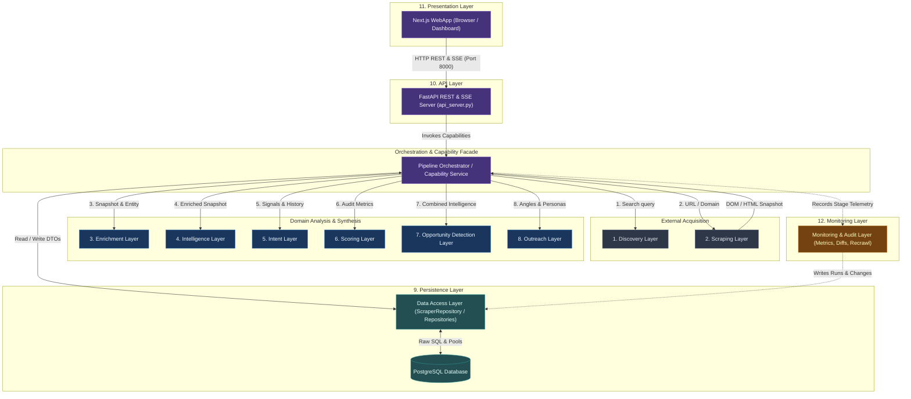
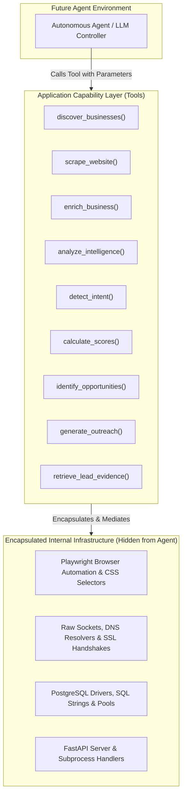

# Architecture Boundaries

**Date:** 2026-10-07  
**Scope:** Architectural Boundary Definition & Layer Contracts  
**Status:** Architecture Design Only (No code modified, no files moved/renamed/deleted, no schema changes)

---

## 1. Layer Diagram

The architecture establishes clean separation of concerns across 12 distinct logical layers. Data flows sequentially through the analytical pipeline, mediated by an Application Service / Orchestrator, with strict isolation between presentation, data access, domain intelligence, and external infrastructure.



---

## 2. Dependency Rules

To prevent code drift, coupling, and hidden regressions, every layer adheres to strict dependency constraints:

1. **Unidirectional Downward / Inward Flow:**
   - Presentation depends **only** on the API Layer over HTTP.
   - API Layer depends **only** on Application Services and Persistence.
   - Analytics layers (Enrichment, Intelligence, Intent, Scoring, Opportunity, Outreach) are **pure domain services** that depend only on standard libraries and typed data structures.
2. **Zero Direct Database Coupling from Domain Logic:**
   - Layers 1 through 8 (Discovery, Scraping, Enrichment, Intelligence, Intent, Scoring, Opportunity, Outreach) must **never** import database drivers (`psycopg2`), connection managers, or repository objects.
   - Any database data required for analysis (e.g. competitor records, historical review snapshots) must be queried by the Persistence layer and supplied to the domain functions as typed entities.
3. **Zero Direct Database Coupling from Presentation:**
   - Layer 11 (Presentation / Next.js) must **never** connect directly to PostgreSQL or import Node `pg`. All data must be fetched through Layer 10 (API).
4. **Zero Raw SQL in API Endpoints:**
   - Layer 10 (API) must **never** write inline SQL queries. All data access must pass through repository methods.
5. **Shared DOM Snapshot Reuse:**
   - Layer 2 (Scraping) is the sole owner of raw webpage retrieval. Downstream layers (Enrichment, Intelligence, Intent) must consume the pre-fetched `RawScrapeSnapshot` instead of issuing independent HTTP GET requests to the target domain.
6. **Decoupled External Infrastructure:**
   - Playwright browser contexts, raw sockets, and third-party LLM HTTP requests must be encapsulated within their designated infrastructure connectors. No caller should ever deal with raw sockets or browser handles.

---

## 3. Layer Contracts

### Summary Matrix

| Layer | Responsibility | Inputs | Outputs | Allowed Dependencies | Forbidden Dependencies |
| :--- | :--- | :--- | :--- | :--- | :--- |
| **1. Discovery** | Search directories and maps to find candidate businesses | Keyword, Location, Source, Limit | `List[DiscoveredBusiness]` | Playwright, BeautifulSoup, requests, logging | Persistence (`db.py`), Analysis layers, API, Presentation |
| **2. Scraping** | Fetch website DOM and technical network signals | `target_url`, `domain` | `RawScrapeSnapshot`, `TechSignalSnapshot` | requests, BeautifulSoup, dnspython, Playwright | Persistence, Scoring, Outreach, API, Presentation |
| **3. Enrichment** | Extract tech stack, emails, decision makers, and deduplicate | `DiscoveredBusiness`, `RawScrapeSnapshot` | `EnrichmentProfile` | BeautifulSoup, dnspython, rapidfuzz | Persistence, Scoring, Outreach, Presentation |
| **4. Intelligence** | Audit conversion friction, review sentiment, trust, and competitors | `RawScrapeSnapshot`, `ReviewList`, `CompetitorList` | `BusinessIntelligenceProfile` | BeautifulSoup, regex, standard library | Persistence (`ScraperRepository`), Outreach, API, UI |
| **5. Intent** | Detect technical hiring, copyright freshness, and review trends | `RawScrapeSnapshot`, `ReviewHistorySummary` | `IntentProfile` | requests (career paths), BeautifulSoup | Persistence (`repo`), Outreach, Scoring, UI |
| **6. Scoring** | Calculate deterministic heuristic opportunity scores | `TechSignalSnapshot`, `SEOAuditResult`, `EnrichmentProfile` | `ScoringResult` | Python standard library, typing | Persistence, External Network I/O, Outreach, UI |
| **7. Opportunity** | Map technical weaknesses to commercial service pitches and reports | `BusinessAuditContext` | `OpportunityProfile` | Python standard library, string formatters | Persistence, External Network I/O, API, UI |
| **8. Outreach** | Draft cold email and WhatsApp sales copy via LLM or templates | `BusinessAuditContext`, `OpportunityProfile`, `Channel` | `OutreachDrafts` | requests (LLM API), env config, standard library | Persistence, Scrapers, Playwright, UI |
| **9. Persistence** | Manage relational database operations, transactions, and pools | Domain DTOs, Query Criteria | Persisted Entities, Records, IDs | psycopg2, ThreadedConnectionPool, schema | Scrapers, Playwright, LLM APIs, Next.js, FastAPI routes |
| **10. API** | Expose REST & SSE endpoints, authenticate, orchestrate jobs | HTTP Requests (JSON / params) | HTTP Responses (JSON / SSE) | FastAPI, Pydantic, Persistence, Orchestrator | Direct SQL strings, Next.js internals, Playwright |
| **11. Presentation** | Visual dashboard for reviewing leads, triggers, and runs | User actions, API responses | Rendered UI, User feedback | Next.js, React, Tailwind CSS, API HTTP client | Direct PostgreSQL (`pg`), Python backend modules |
| **12. Monitoring** | Measure stage durations, detect DOM diffs, schedule recrawls | Pipeline events, DOM hashes | `RunMetrics`, `ChangeEvent`, `RecrawlSchedule` | hashlib, json, datetime, Persistence | Scrapers (except dispatch), Outreach, UI |

---

### Detailed Layer Specifications

#### Layer 1: Discovery
1. **Responsibility:** Search public directories (Google Maps, JustDial, IndiaMart) and schedule overdue recrawls to identify candidate businesses.
2. **What it may depend on:** External network connectors (Playwright, HTTP client, BeautifulSoup), logging utility, shared DTOs (`DiscoveredBusiness`).
3. **What it must NOT depend on:** Persistence layer (`ScraperRepository`, `db.py`), downstream analytics modules, API, Presentation.
4. **Expected inputs:** `query: Optional[str]`, `category: Optional[str]`, `city: Optional[str]`, `state: Optional[str]`, `country: Optional[str]`, `limit: int`.
5. **Expected outputs:** `List[DiscoveredBusiness]` (name, phone, address, website, rating, review count, source platform).
6. **External I/O allowed:** YES (External Network: Playwright browser navigation, directory HTTP GET). Filesystem: No.
7. **Database access allowed:** FORBIDDEN. Discovery connectors must never execute SQL.
8. **Future agent/tool interaction:**  
   `tool: discover_businesses(query: str, category: str, location: str, source: str = "gmaps", limit: int = 10) -> List[DiscoveredBusiness]`  
   The agent triggers searches by intent; the tool encapsulates Playwright selectors, pagination, and anti-blocking logic.

---

#### Layer 2: Scraping (DOM & Technical Signals)
1. **Responsibility:** Fetch raw HTML and extract network-level technical signals (DNS, SSL certificate, OpenCorporates status, public social handles).
2. **What it may depend on:** Network libraries (`requests`, `beautifulsoup4`, `dnspython`, `playwright`), logging, shared exceptions.
3. **What it must NOT depend on:** Persistence, scoring engines, opportunity mappers, outreach generators, API, Presentation.
4. **Expected inputs:** `target_url: str`, `domain: str`, optional `company_name: str`.
5. **Expected outputs:** `RawScrapeSnapshot` (raw HTML, parsed DOM tree, response time, HTTP status, headers) and `TechSignalSnapshot` (SSL validity, SSL expiration, DNS status, MX records).
6. **External I/O allowed:** YES (External Network: HTTP requests, raw socket connections, DNS queries). Filesystem: No.
7. **Database access allowed:** FORBIDDEN.
8. **Future agent/tool interaction:**  
   `tool: scrape_website(url: str) -> RawScrapeSnapshot`  
   `tool: inspect_technical_signals(domain: str) -> TechSignalSnapshot`  
   The agent requests inspections without handling sockets, SSL verification, or DOM parsers.

---

#### Layer 3: Enrichment
1. **Responsibility:** Augment business profiles by detecting technical signatures (CMS, frameworks, analytics), extracting contact emails, validating MX DNS records, identifying decision makers, and resolving duplicate entities.
2. **What it may depend on:** Pre-fetched `RawScrapeSnapshot`, parsing tools (`beautifulsoup4`, `rapidfuzz`, `dnspython`).
3. **What it must NOT depend on:** Persistence directly, scoring engines, outreach generators, API, Presentation.
4. **Expected inputs:** `business_profile: DiscoveredBusiness`, `snapshot: RawScrapeSnapshot`.
5. **Expected outputs:** `EnrichmentProfile` (`tech_stack: TechStackResult`, `emails: EmailIntelligenceResult`, `decision_makers: List[DecisionMaker]`, `social_profiles: SocialAnalysisResult`).
6. **External I/O allowed:** LIMITED (DNS queries for MX records; optional targeted HTTP GET for `/about` or `/team` if missing from snapshot). Filesystem: No.
7. **Database access allowed:** FORBIDDEN. Entity resolution operates on candidate lists passed by the caller.
8. **Future agent/tool interaction:**  
   `tool: enrich_business(business: DiscoveredBusiness, snapshot: RawScrapeSnapshot) -> EnrichmentProfile`  
   The agent enriches raw leads into actionable business entities.

---

#### Layer 4: Intelligence
1. **Responsibility:** Perform in-depth commercial analysis: detect conversion friction (missing CTAs, booking flows, WhatsApp), mine customer review sentiments and praise/complaints, extract operational bottlenecks, detect trust signals (badges, certs, testimonials), and evaluate local competitive gaps.
2. **What it may depend on:** `RawScrapeSnapshot`, normalized review collections, pre-fetched competitor records, standard regex and text analysis libraries.
3. **What it must NOT depend on:** Persistence layer (`ScraperRepository`, `DatabaseManager`), scoring engines, outreach generators, API, Presentation.
4. **Expected inputs:** `business: DiscoveredBusiness`, `snapshot: RawScrapeSnapshot`, `reviews: List[ReviewItem]`, `competitors: List[CompetitorSnapshot]`.
5. **Expected outputs:** `BusinessIntelligenceProfile` (`conversion_analysis`, `review_mining`, `customer_pain`, `trust_signals`, `competitor_analysis`, `business_health`).
6. **External I/O allowed:** NONE (all analyses execute over passed memory snapshots).
7. **Database access allowed:** FORBIDDEN. (Currently `CompetitorAnalyzer` imports `repo`; this violates boundaries and must be refactored to accept `competitors: List[CompetitorSnapshot]`).
8. **Future agent/tool interaction:**  
   `tool: analyze_business_intelligence(business: DiscoveredBusiness, snapshot: RawScrapeSnapshot, competitors: List[CompetitorSnapshot]) -> BusinessIntelligenceProfile`  
   The agent requests deep analysis without orchestrating 6 separate submodules.

---

#### Layer 5: Intent
1. **Responsibility:** Detect buying intent and digital urgency signals: technical hiring demand (`/careers`), digital neglect / freshness (expired copyright, expiring SSL), and review velocity trends.
2. **What it may depend on:** `RawScrapeSnapshot`, targeted career page parser, pre-fetched historical review metrics, standard library.
3. **What it must NOT depend on:** Persistence (`repo`), scoring engine, outreach generator, Presentation.
4. **Expected inputs:** `website_url: str`, `snapshot: RawScrapeSnapshot`, `historical_review_summary: Optional[ReviewHistorySummary]`.
5. **Expected outputs:** `IntentProfile` (`hiring_signals: HiringSignalResult`, `freshness_signals: FreshnessResult`, `review_trend_signals: ReviewTrendResult`, `intent_score: float`, `urgency_level: str`).
6. **External I/O allowed:** LIMITED (HTTP GET for career page paths `/careers`, `/jobs` if not pre-fetched).
7. **Database access allowed:** FORBIDDEN. (Currently `ReviewTrendDetector` imports `repo`; caller must supply `historical_review_summary`).
8. **Future agent/tool interaction:**  
   `tool: detect_intent(website_url: str, snapshot: RawScrapeSnapshot, history: Optional[ReviewHistorySummary]) -> IntentProfile`  
   The agent assesses lead urgency and buying readiness.

---

#### Layer 6: Scoring
1. **Responsibility:** Calculate deterministic, heuristic scores evaluating digital deficiency: `opportunity_score` (0–100, where higher indicates greater sales opportunity), `website_quality_score`, `seo_score`, and `automation_need_score`.
2. **What it may depend on:** `TechSignalSnapshot`, `SEOAuditResult`, `EnrichmentProfile`.
3. **What it must NOT depend on:** Persistence, external network I/O, outreach generation, Presentation, API.
4. **Expected inputs:** Structured technical and presence metrics.
5. **Expected outputs:** `ScoringResult` (scores, breakdown penalties, detected pain points).
6. **External I/O allowed:** NONE (pure CPU algorithmic computation).
7. **Database access allowed:** FORBIDDEN.
8. **Future agent/tool interaction:**  
   `tool: calculate_scores(tech_signals: TechSignalSnapshot, seo: SEOAuditResult, enrichment: EnrichmentProfile) -> ScoringResult`  
   The agent calculates baseline opportunity metrics deterministically.

---

#### Layer 7: Opportunity Detection
1. **Responsibility:** Synthesize technical weaknesses, conversion friction, competitor gaps, and intent signals into structured service recommendations (`service_recommendations`), business rationale (`opportunity_reasoning`), and human-readable audit reports.
2. **What it may depend on:** Scoring results, Intelligence profile, Intent profile, Enrichment profile, standard library.
3. **What it must NOT depend on:** Persistence, external network I/O, API server, Presentation.
4. **Expected inputs:** `BusinessAuditContext` (synthesized container of all prior stage findings).
5. **Expected outputs:** `OpportunityProfile` (`service_recommendations: List[str]`, `pitch_angles: List[str]`, `opportunity_reasoning: str`, `executive_report_text: str`).
6. **External I/O allowed:** NONE (pure domain logic and formatting).
7. **Database access allowed:** FORBIDDEN.
8. **Future agent/tool interaction:**  
   `tool: identify_opportunities(audit_context: BusinessAuditContext) -> OpportunityProfile`  
   The agent extracts commercial opportunities and pitch strategies from technical evidence.

---

#### Layer 8: Outreach
1. **Responsibility:** Draft personalized sales copy (cold email, WhatsApp message, subject line, follow-up angles) tailored to the decision maker and detected business opportunities.
2. **What it may depend on:** `OpportunityProfile`, `DecisionMaker`, business metadata, LLM provider client, environment configuration.
3. **What it must NOT depend on:** Persistence, Scrapers, Discovery, Presentation, API server.
4. **Expected inputs:** `business_name: str`, `decision_maker: Optional[DecisionMaker]`, `opportunity: OpportunityProfile`, `channel: str`.
5. **Expected outputs:** `OutreachDrafts` (`subject: str`, `email_body: str`, `whatsapp_message: str`, `positioning_angle: str`, `mode: str`).
6. **External I/O allowed:** YES (Outbound HTTPS calls to LLM provider endpoints: Gemini / OpenAI). Filesystem: No.
7. **Database access allowed:** FORBIDDEN.
8. **Future agent/tool interaction:**  
   `tool: generate_outreach(business_name: str, decision_maker: Optional[DecisionMaker], opportunity: OpportunityProfile, channel: str = "all") -> OutreachDrafts`  
   The agent generates tailored sales copy or requests alternate angles without managing prompt formatting or LLM API tokens.

---

#### Layer 9: Persistence
1. **Responsibility:** Sole custodian of relational database storage, transactions, migrations, connection pools, and record queries for all 15+ platform entities.
2. **What it may depend on:** PostgreSQL driver (`psycopg2`), connection pool (`ThreadedConnectionPool`), SQL schemas, domain DTOs.
3. **What it must NOT depend on:** Scrapers, Playwright, LLM APIs, Next.js / React, FastAPI endpoints, CLI argument parsing.
4. **Expected inputs:** Domain DTOs, query filter criteria, transaction commands.
5. **Expected outputs:** Persisted entity models, IDs, query result sets, paginated lists.
6. **External I/O allowed:** YES (Database TCP network socket to PostgreSQL). Filesystem: Schema DDL file read only.
7. **Database access allowed:** **SOLE OWNER.** Only this layer is permitted to execute SQL or acquire database connections.
8. **Future agent/tool interaction:**  
   `tool: get_business_details(business_id: int) -> BusinessDetails`  
   `tool: query_prospects(filters: ProspectFilters) -> List[ProspectSummary]`  
   The agent queries or updates records through high-level repository queries, never through raw SQL.

---

#### Layer 10: API
1. **Responsibility:** Expose platform capabilities over HTTP REST and SSE streaming endpoints for clients. Handle authentication, request validation, CORS, error normalization, and pipeline task dispatching.
2. **What it may depend on:** Persistence Layer (Repositories), Application Orchestrator / Services, FastAPI, Pydantic, Uvicorn.
3. **What it must NOT depend on:** Direct SQL strings, Presentation/Next.js internals, direct Playwright scripts.
4. **Expected inputs:** HTTP Requests (JSON payloads, query parameters, route parameters).
5. **Expected outputs:** HTTP Responses (JSON, SSE event streams, status codes).
6. **External I/O allowed:** YES (HTTP socket server).
7. **Database access allowed:** ONLY via Persistence Layer (`ScraperRepository` or domain repositories). **Inline SQL queries are strictly forbidden.**
8. **Future agent/tool interaction:**  
   Can serve as an HTTP gateway for remote agents or external agent frameworks.

---

#### Layer 11: Presentation (Dashboard)
1. **Responsibility:** Visual user interface for exploring leads, inspecting audit scores and outreach drafts, launching scrape tasks, and monitoring real-time logs.
2. **What it may depend on:** API Layer (HTTP REST endpoints, SSE `/api/logs`), Next.js 16, React 19, Tailwind CSS.
3. **What it must NOT depend on:** Direct PostgreSQL connection (`pg`, `src/lib/db.ts`), Python modules, Scrapers, Playwright.
4. **Expected inputs:** User interactions, API HTTP responses, SSE log streams.
5. **Expected outputs:** Rendered UI views, visual feedback, notifications.
6. **External I/O allowed:** YES (Client/Server HTTP calls to API server at port 8000).
7. **Database access allowed:** **COMPLETELY FORBIDDEN.** The dashboard must not hold database credentials or connect to PostgreSQL.
8. **Future agent/tool interaction:**  
   Presentation acts as the human interface. An agent can surface actions, status reports, or generated copy to the dashboard via API.

---

#### Layer 12: Monitoring
1. **Responsibility:** Observe system execution: record stage-level run metrics and error counts, compute DOM/content SHA-256 diffs between crawls, and calculate recrawl schedules.
2. **What it may depend on:** Standard library (`hashlib`, `json`, `datetime`), domain DTOs, Persistence Layer.
3. **What it must NOT depend on:** Scrapers (except dispatch), outreach generators, Presentation.
4. **Expected inputs:** Pipeline stage events, raw snapshots, historical crawl hashes.
5. **Expected outputs:** `PipelineRunMetrics`, `ChangeEvent`, `RecrawlSchedule`.
6. **External I/O allowed:** Low / Internal (logging, telemetry).
7. **Database access allowed:** Only via Persistence Layer.
8. **Future agent/tool interaction:**  
   `tool: get_lead_change_history(business_id: int) -> List[ChangeEvent]`  
   `tool: get_pipeline_health() -> PipelineHealthMetrics`  
   The agent monitors lead changes and pipeline execution health.

---

## 4. Database Boundary

The database boundary isolates PostgreSQL behind a strict persistence firewall. Currently, three severe architectural violations compromise this boundary:

```
[Current Architectural Violations]
1. Next.js Server Components ----(Node pg direct query)----> [PostgreSQL Database]  (VIOLATION)
2. api_server.py ----------------(Inline ad-hoc SQL)--------> [PostgreSQL Database]  (VIOLATION)
3. CompetitorAnalyzer / Trend ---(Injected repo query)------> [PostgreSQL Database]  (VIOLATION)
```

### Approved Boundary Architecture

```
[Clean Target Architecture]
Next.js UI --------> FastAPI REST API --------> Domain Repositories --------> PostgreSQL DB
                                                       ^
                                                       |
CLI Orchestrator / Future Agent -----------------------+
```

### 1. Presentation Decoupling
- **Current State:** Next.js Server Components (`src/app/page.tsx`, `src/app/business/[id]/page.tsx`, `src/app/runs/page.tsx`) import `query` from `src/lib/db.ts` and query PostgreSQL directly using Node `pg`.
- **Boundary Rule:** `dashboard/src/lib/db.ts` must be retired. Next.js must fetch all data via `fetch('http://127.0.0.1:8000/api/...')` from FastAPI endpoints. This unifies data contracts, eliminates duplicate SQL in TypeScript, and prevents connection pool exhaustion.

### 2. API Direct SQL Elimination
- **Current State:** In `api_server.py`, endpoints `/api/businesses` (DELETE), `/api/businesses/{id}` (DELETE), `/api/businesses/batch-delete` (POST), and `/api/businesses/{id}` (PATCH) bypass `ScraperRepository` and execute raw SQL directly against `db_manager.get_connection()`.
- **Boundary Rule:** All inline SQL in `api_server.py` must be removed and replaced with dedicated repository methods:
  - `repo.delete_business(business_id: int)`
  - `repo.batch_delete_businesses(business_ids: List[int])`
  - `repo.update_outreach_status(business_id: int, status: str)`

### 3. Decoupling Domain Analytics from Database DAO
- **Current State:** `business_intelligence/competitor_analyzer.py` and `intent/review_trend_detector.py` receive `repo: ScraperRepository` in `__init__` and issue SQL queries inside their analysis methods.
- **Boundary Rule:** Domain analytics modules must be pure functions/services. The Application Orchestrator must query the needed historical reviews or local competitor records from the repository and pass them as plain dataclasses into `.analyze()`:
  - `CompetitorAnalyzer.analyze(business_id, business_name, category, address, score, competitors: List[CompetitorSnapshot])`
  - `ReviewTrendDetector.detect(business_name, reviews, history: Optional[ReviewHistorySummary])`

### 4. Modular Repository Decomposition
- **Current State:** `database/db.py` contains a monolithic `ScraperRepository` spanning 1,312 lines and 38 queries.
- **Target Design:** Decompose `ScraperRepository` into logical domain repositories sharing a single `DatabaseManager`:
  - `BusinessRepository`: CRUD for `businesses`.
  - `AuditRepository`: Persistence for `website_analyses`, `scoring_results`, `tech_stacks`, `email_intelligence`.
  - `IntelligenceRepository`: Persistence for `business_health_profiles`, `competitor_analysis`, `customer_pain_signals`, `intent_profiles`.
  - `OutreachRepository`: Persistence for `outreach_drafts`, `business_reports`.
  - `MonitoringRepository`: Persistence for `pipeline_runs`, `change_events`.

---

## 5. Future Agent Boundary

A future AI agent will act as an intelligent workflow coordinator rather than a script executor. The agent must interact with the platform through **high-level capability tools**, completely shielded from raw infrastructure.



### Agent Access Rules: Allowed vs. Forbidden

| Category | Allowed for Future Agent | Forbidden for Future Agent |
| :--- | :--- | :--- |
| **Data Discovery** | Calling `discover_businesses(query, location, limit)` | Interacting with Playwright, browser contexts, or HTML DOM selectors |
| **Web Crawling** | Calling `scrape_website(url)` and receiving `RawScrapeSnapshot` | Crafting raw HTTP headers, user-agents, proxy rotators, or raw socket requests |
| **Enrichment** | Calling `enrich_business(lead, snapshot)` | Invoking regex parsers, MX lookups, or fuzzy string distance functions directly |
| **Intelligence** | Calling `analyze_intelligence(lead, snapshot, competitors)` | Querying competitor tables or computing raw math matrices |
| **Scoring & Intent** | Calling `calculate_scores()` and `detect_intent()` | Hardcoding penalty weights or tweaking urgency threshold math |
| **Outreach** | Calling `generate_outreach(lead, opportunity, channel)` | Writing raw LLM prompt boilerplate or managing external LLM API tokens |
| **Data Persistence** | Calling `retrieve_lead_evidence(id)` or `save_lead(lead)` | Executing SQL queries, transactions, or opening database connections |

---

## 6. Evaluation of P3 Migration Proposals against Boundary Design

In `AI_MEMORY/CANONICAL_MODULES.md` (P3), five primary architectural migration decisions were proposed. Below is their evaluation against the boundary rules established in P4:

### Proposal 1: Retire 6 Dead Stubs in `analyzer/`
- **P3 Proposal:** Safely remove the placeholder stubs in `analyzer/` (`business_health_score.py`, `competitor_analyzer.py`, `customer_pain_extractor.py`, `review_miner.py`, `trust_signal_detector.py`, `website_conversion_analyzer.py`, `growth_signal_detector.py`, `social_analyzer.py`).
- **Boundary Architecture Evaluation:** **APPROVED (High Priority).**  
  Leaving duplicate stubs in `analyzer/` with incompatible signatures directly violates the layer boundary between Layer 6 (Scoring/SEO in `analyzer/`) and Layer 4 (Intelligence in `business_intelligence/`). It creates extreme ambiguity for future tool exposure and agent integrations.

### Proposal 2: Retire Orphaned `scraper/pipeline.py`
- **P3 Proposal:** Remove legacy `scraper/pipeline.py` (`AcquisitionPipeline`).
- **Boundary Architecture Evaluation:** **APPROVED.**  
  `scraper/pipeline.py` represents a legacy orchestration attempt that couples discovery, scraping, file persistence, and old analyzers in a single dead file. Layer 1 (Discovery) and Layer 2 (Scraping) must remain decoupled from pipeline orchestration.

### Proposal 3: Decouple Next.js Frontend from Direct PostgreSQL
- **P3 Proposal:** Remove Node `pg` from `dashboard/` and route all queries through FastAPI REST endpoints.
- **Boundary Architecture Evaluation:** **APPROVED (Critical Priority).**  
  Direct DB queries from Next.js break the Database Boundary, create dual schema duplication in TypeScript, bypass API validation, and make it impossible to enforce uniform access control.

### Proposal 4: Implement Shared DOM/HTML Snapshot Caching
- **P3 Proposal:** Cache the HTML response in `WebsiteAnalyzer` and pass it to downstream analyzers (`TechStackDetector`, `EmailExtractor`, `DecisionMakerFinder`, `FreshnessMonitor`, `ConversionAnalyzer`, `TrustSignalDetector`).
- **Boundary Architecture Evaluation:** **APPROVED (High Priority).**  
  Strictly enforces the boundary between Layer 2 (Scraping) and Layers 3–5 (Analysis). Analysis layers should analyze data, not repeatedly re-acquire it over the public internet.

### Proposal 5: Decouple Domain Analytics from Database DAO
- **P3 Proposal:** Stop injecting `repo` into `CompetitorAnalyzer` and `ReviewTrendDetector`.
- **Boundary Architecture Evaluation:** **APPROVED (High Priority).**  
  Enforces the boundary rule that domain analysis layers must be pure services with zero database dependencies.

---

## 7. Architectural Status & Guardrails

- **Current Phase:** P4 (Architecture Boundaries) complete.
- **Next Phase:** P5 (Implementation Planning / Execution).
- **Enforcement:** No source files modified, no dependencies added, no files deleted, no agent frameworks introduced. All boundaries are documented and ready for systematic implementation.
