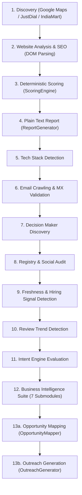
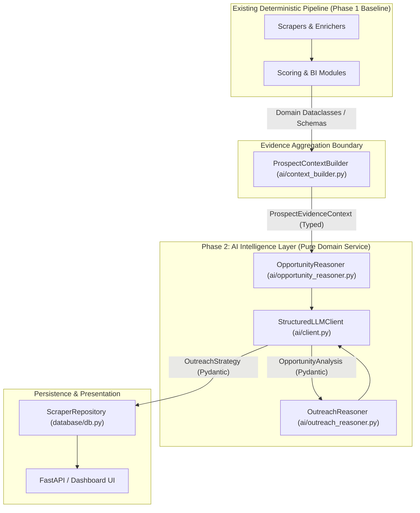

# Phase 2 — AI Intelligence Architecture Audit

**Date:** 2026-10-08  
**Scope:** AI/LLM Intelligence Layer Architecture, Data Flow Audit, Semantic Reconciliation, and Boundary Design  
**Status:** Audit Complete — No Application Code Modified  

---

## 1. Executive Summary

Phase 1 established a frozen 12-layer deterministic foundation: scrapers, technical signal analyzers, enrichment pipelines, heuristic scorers, business intelligence extractors, intent evaluators, and Pydantic v2 schemas.

This audit evaluates how an **AI/LLM Intelligence Layer** should be introduced into the existing platform without breaking Phase 1 stability.

### Primary Audit Findings:
1. **Severe Context Starvation in Existing Outreach:** The pipeline generates deep intelligence across 13 distinct stages (conversion friction, customer complaints, competitor gaps, hiring intent, tech stack, and registration history), but [`pipeline_runner.py`](file:///Users/ashik/Bens%20Repository/scrapper/pipeline_runner.py) discards over 80% of this evidence when calling [`analyzer/outreach_generator.py`](file:///Users/ashik/Bens%20Repository/scrapper/analyzer/outreach_generator.py).
2. **Ad-Hoc LLM Calls Embedded in Analyzer:** [`analyzer/outreach_generator.py`](file:///Users/ashik/Bens%20Repository/scrapper/analyzer/outreach_generator.py) currently performs raw, un-abstracted `requests.post()` calls directly to Gemini/OpenAI HTTP endpoints using hardcoded JSON schemas and string interpolation.
3. **Critical Polarity Conflict (`opportunity_score` vs `business_health_score`):**
   - `opportunity_score` is a **deficiency penalty** (100 = broken presence = maximum agency sales pitch opportunity).
   - `business_health_score` is a **health rating** (100 = thriving presence, 0 = failing).
   Without explicit semantic grounding, an LLM or autonomous agent will misinterpret healthy businesses as high-priority prospects and vice versa.
4. **Clean Boundary Opportunity:** An AI Intelligence Layer should operate as an isolated **downstream synthesis capability**:
   ```
   Deterministic Pipeline → Structured Evidence → AI Intelligence Layer → Typed AI Output → Persistence / UI
   ```
   The AI layer must **never** execute scraping, run browser automation, execute SQL, or modify deterministic scoring math.

---

## 2. Current AI-Relevant Data Flow

The current data flow in [`pipeline_runner.py`](file:///Users/ashik/Bens%20Repository/scrapper/pipeline_runner.py) executes sequentially across 13 stages for each prospect:



### Critical Flow Observations & Bottlenecks:
1. **Report Generator is Premature (Step 4):** [`ReportGenerator`](file:///Users/ashik/Bens%20Repository/scrapper/analyzer/business_report_generator.py) runs at Step 4, before Tech Stack, Decision Makers, Intent, and Business Intelligence are even executed. Consequently, the generated client report contains zero review insights, zero competitor comparisons, and zero intent signals.
2. **Opportunity Mapper is Rigid (Step 13a):** [`OpportunityMapper`](file:///Users/ashik/Bens%20Repository/scrapper/business_intelligence/opportunity_mapper.py) uses 5 hardcoded `if/else` checks matching keywords like `"booking"` or `"whatsapp"`. It lacks contextual reasoning to adapt recommendations to specific verticals (e.g. recommending emergency dispatch for plumbers vs booking engines for salons).
3. **Outreach Generator Disconnect (Step 13b):** Line 468 of [`pipeline_runner.py`](file:///Users/ashik/Bens%20Repository/scrapper/pipeline_runner.py) passes only `score_dict` and `analysis_dict` into `outreach_generator.generate_outreach()`. It omits customer complaints, review sentiment, competitor gaps, hiring roles, and tech stack details.

---

## 3. Existing Structured Evidence

The platform already extracts and calculates rich, high-fidelity business evidence across 15 domain modules. This evidence is currently stored in PostgreSQL and represented in memory as dataclasses:

| Category | Source Module | Available Structured Evidence | LLM Usability |
| :--- | :--- | :--- | :--- |
| **Identity & Footprint** | `GoogleMapsScraper`, `WebsiteAnalyzer` | Business name, category, address, phone, website URL, coordinates, HTTP status, load time, mobile friendliness | **High:** Provides anchor context for the prospect |
| **Technical Stack** | `TechStackDetector` | CMS (e.g. WordPress, Wix), frontend framework (React, Next.js), analytics tags (GA4, Meta Pixel), eCommerce engines | **High:** Identifies technical obsolescence and digital capability |
| **Decision Makers** | `DecisionMakerFinder` | Candidate names, inferred leadership roles (Founder, Managing Director), source URLs, confidence scores | **Critical:** Required for personalized salutations |
| **Conversion Friction** | `ConversionAnalyzer` | Missing online booking, weak/missing CTAs, lead capture forms absent, contact friction, WhatsApp chat availability | **Critical:** Primary commercial pain point justification |
| **Customer Sentiment** | `ReviewMiner`, `CustomerPainExtractor` | Rating, review count, recurring complaints, praise themes, operational bottlenecks, communication failures | **Highest Value:** Direct voice of customer; prime material for high-converting sales pitches |
| **Competitive Context** | `CompetitorAnalyzer` | Local competitors in same city/category, competitor ratings, competitor opportunity scores, digital gap summary | **High:** Creates local urgency ("Competitor X has online booking while you do not") |
| **Buying Intent** | `HiringSignalDetector`, `FreshnessMonitor`, `ReviewTrendDetector` | Active technical job postings, copyright staleness (e.g. "© 2019"), SSL days remaining, 90-day rating trajectory | **High:** Establishes why outreach should happen *now* |
| **SEO & Discoverability** | `SEOChecker` | Missing H1, missing meta title/description, robots.txt missing, sitemap missing, unoptimized images | **Medium:** Supporting evidence for SEO/traffic pitches |
| **Registry & Credibility** | `OpenCorporatesScraper`, `TrustSignalDetector` | Incorporation date, company number, SSL status, customer testimonials, trust badges | **Medium:** Grounds business maturity and establishment |

---

## 4. Deterministic vs LLM Responsibilities

To maintain platform stability, high performance, and cost efficiency, there must be an absolute division between deterministic software logic and LLM reasoning.

### What Must Remain DETERMINISTIC SOFTWARE:
1. **Data Acquisition & Extraction:** Playwright browser automation, HTTP requests, HTML DOM querying, socket DNS checks, MX record validation.
2. **Numeric Scoring & Math:** Calculating `opportunity_score`, `website_quality_score`, `seo_score`, `automation_need_score`, and `overall_health_score`.
3. **Threshold Classification:** Classifying recrawl cadences, rating categories (`good`, `average`, `poor`), and review volume tiers.
4. **Entity Resolution:** RapidFuzz fuzzy string matching and phone/address deduplication algorithms.
5. **Persistence & Transactions:** SQL query execution, transaction rollbacks, database connection management.
6. **Task Execution & Rate Limiting:** Subprocess orchestration, API route dispatching, log streaming.

### What Belongs to LLM REASONING:
1. **Cross-Signal Evidence Synthesis:** Correlating disparate evidence into a unified diagnosis (e.g., *Hiring a front-desk receptionist* + *Reviews saying "never answers phone"* + *Missing WhatsApp widget* → High-priority communication automation opportunity).
2. **Contextual Commercial Reasoning:** Diagnosing *why* technical flaws hurt this specific business model and estimating commercial impact (e.g., why a dental clinic loses high-margin implants without an online booking flow).
3. **Strategic Service Tailoring:** Formulating tailored service packages based on category, competitive gap, and customer complaints rather than choosing from 5 hardcoded template strings.
4. **Objection Anticipation & Sales Briefing:** Generating consultative talking points, pitch angles, and likely merchant objections for sales reps.
5. **Consultative Outreach Copywriting:** Drafting natural, empathetic cold emails and WhatsApp messages that reference verified evidence without sounding robotic, hyperbolic, or spammy.

---

## 5. Recommended AI Boundary

The AI Intelligence Layer must be introduced as an **isolated, downstream capability service**. It does not replace or modify the upstream acquisition or scoring pipelines.



### Architectural Guardrails:
- The AI layer sits **after** deterministic analysis and **before** final persistence.
- The AI layer receives pre-compiled, structured evidence entities; it never initiates network calls to targets or queries PostgreSQL directly.
- The AI layer outputs strongly-typed Pydantic models with validated schemas; it never emits uncontrolled raw strings.
- Upstream deterministic stages remain 100% operational in headless or offline environments where LLM API keys are absent.

---

## 6. Existing Schema Readiness

Phase 1 established typed Pydantic v2 schemas in [`schemas/`](file:///Users/ashik/Bens%20Repository/scrapper/schemas). Below is their readiness to support the AI Intelligence layer:

| Schema | File | Readiness for AI Layer | Necessary Adaptations for Phase 2 |
| :--- | :--- | :--- | :--- |
| **`Business`** | [`schemas/business.py`](file:///Users/ashik/Bens%20Repository/scrapper/schemas/business.py) | **Ready:** Full support for core prospect attributes. | None. Used as base identity input. |
| **`BusinessEnrichment`** | [`schemas/enrichment.py`](file:///Users/ashik/Bens%20Repository/scrapper/schemas/enrichment.py) | **Ready:** Carries tech stack, validated emails, and decision makers. | None. Feeds prospect leadership context. |
| **`BusinessIntelligence`** | [`schemas/intelligence.py`](file:///Users/ashik/Bens%20Repository/scrapper/schemas/intelligence.py) | **Ready:** Carries conversion friction, review sentiment, complaints, and competitor gaps. | Add explicit field for `evidence_references` if citation tracking is required. |
| **`IntentProfile`** | [`schemas/intent.py`](file:///Users/ashik/Bens%20Repository/scrapper/schemas/intent.py) | **Ready:** Carries hiring, review trend, freshness scores, and urgency. | None. Feeds outreach urgency context. |
| **`Opportunity`** | [`schemas/opportunity.py`](file:///Users/ashik/Bens%20Repository/scrapper/schemas/opportunity.py) | **Partial Readiness:** Holds scores and `ServiceRecommendation`, but lacks structured executive reasoning fields. | Add fields for `executive_diagnosis`, `value_proposition`, and `commercial_pitch_angle`. |
| **`OutreachDraft`** | [`schemas/outreach.py`](file:///Users/ashik/Bens%20Repository/scrapper/schemas/outreach.py) | **Partial Readiness:** Holds drafts and angles, but lacks reasoning metadata. | Add fields for `target_decision_maker_context`, `objection_preemptions`, and `cited_evidence_points`. |
| **`PipelineResult`** | [`schemas/pipeline.py`](file:///Users/ashik/Bens%20Repository/scrapper/schemas/pipeline.py) | **Ready:** Top-level envelope combining all models. | Can seamlessly host AI reasoning results. |

---

## 7. Opportunity and Score Semantics

### The Core Semantic Ambiguity
A critical finding of this audit is the **divergent polarity** between the two primary score metrics in the codebase:

```
[Deficiency Metric: Opportunity Score]
0 ───────────────────────────────────────────────► 100
(Perfect Site / No Opportunity)               (Completely Broken / Maximum Sales Opportunity)

[Health Metric: Business Health Score]
0 ───────────────────────────────────────────────► 100
(Failing / Severe Issues)                      (Flourishing / High Digital Health)
```

1. **`opportunity_score` ([`analyzer/scoring_engine.py`](file:///Users/ashik/Bens%20Repository/scrapper/analyzer/scoring_engine.py)):**
   - **Polarity:** Higher is WORSE for the prospect, but HIGHER OPPORTUNITY for our sales outreach.
   - A business with no website, missing SSL, and broken forms gets `opportunity_score = 95.0`.
   - In `scoring_engine.py`, `website_quality_score` and `seo_score` are actually **weakness penalty scores** (100 = terrible, 0 = perfect).
2. **`overall_health_score` ([`business_intelligence/business_health_score.py`](file:///Users/ashik/Bens%20Repository/scrapper/business_intelligence/business_health_score.py)):**
   - **Polarity:** Higher is BETTER for the prospect.
   - It inverts `website_quality_score`: `web_health = max(0.0, 100.0 - website_quality_score)`.
   - A flourishing, perfectly optimized business gets `overall_health_score = 95.0`.
3. **`intent_score` ([`intent/intent_engine.py`](file:///Users/ashik/Bens%20Repository/scrapper/intent/intent_engine.py)):**
   - **Polarity:** Higher is MORE RECEPTIVE / URGENT NOW.
   - High intent + High opportunity = Tier 1 Priority Lead.

### Mandatory Pre-Agent Clarification:
The semantics must be explicitly clarified in prompt contexts and documentation before introducing an AI reasoning or agent layer:
- **Rule 1:** In all prompts and AI inputs, explicitly label `opportunity_score` as **`sales_opportunity_score (digital_deficiency_index)`** with the prompt guidance: *"Higher score (e.g. 80-100) indicates acute digital deficiencies and high potential for our agency pitch."*
- **Rule 2:** Label `overall_health_score` as **`digital_health_rating`** with the prompt guidance: *"Higher score (e.g. 80-100) indicates strong existing digital performance."*
- **Rule 3:** Do NOT change the underlying Python variable names in Phase 1 modules; reconcile them inside the `ProspectContextBuilder`.

---

## 8. Proposed AI Module Structure

Phase 2 should introduce a clean, self-contained `ai/` package adhering to the Single Responsibility Principle:

```text
ai/
├── __init__.py                 # Re-exports core AI services and contracts
├── client.py                   # Provider-agnostic structured LLM client (Gemini/OpenAI)
├── models.py                   # Pydantic v2 schemas for AI inputs, prompts, and outputs
├── context_builder.py          # Aggregates Phase 1 schemas into token-efficient LLM evidence
├── opportunity_reasoner.py     # Commercial diagnosis, value proposition, service synthesis
├── outreach_reasoner.py        # Tailored cold messaging, WhatsApp copy, objection handling
└── prompts/
    ├── __init__.py
    ├── opportunity_prompt.py   # System prompts and few-shot formatting for opportunity reasoning
    └── outreach_prompt.py      # System prompts and few-shot formatting for consultative outreach
```

### Module Responsibilities:

1. **`ai/client.py` (`StructuredLLMClient`):**
   - **Responsibility:** Abstracts external LLM API providers (Google Gemini, OpenAI). Enforces JSON structured outputs adhering to Pydantic schemas. Handles retries, timeouts, backoff, and token tracking.
   - **Dependencies:** `requests` / HTTP client, `pydantic`, `os`. (Zero persistence or pipeline dependencies).
2. **`ai/models.py`:**
   - **Responsibility:** Defines domain models for AI inputs (`ProspectEvidenceContext`), intermediate reasoning, and final structured outputs (`OpportunityAnalysis`, `OutreachStrategy`).
   - **Dependencies:** `pydantic`.
3. **`ai/context_builder.py` (`ProspectContextBuilder`):**
   - **Responsibility:** The single bridge between Phase 1 data and Phase 2 AI. Ingests `Business`, `BusinessEnrichment`, `BusinessIntelligence`, `IntentProfile`, and `Opportunity`, strips redundant tokens, resolves score semantic polarities, and formats an evidence payload.
   - **Dependencies:** `schemas.*`.
4. **`ai/opportunity_reasoner.py` (`OpportunityReasoner`):**
   - **Responsibility:** Invokes `StructuredLLMClient` with `opportunity_prompt` to generate deep commercial diagnoses, specific ROI pitches, and tailored service recommendations.
   - **Dependencies:** `ai.client`, `ai.models`.
5. **`ai/outreach_reasoner.py` (`OutreachReasoner`):**
   - **Responsibility:** Ingests the evidence context and generated opportunity reasoning to produce highly personalized, non-spammy cold email and WhatsApp messages.
   - **Dependencies:** `ai.client`, `ai.models`.

---

## 9. Proposed AI Input/Output Contracts

Phase 2 will standardize on strict Pydantic v2 input and output models:

### 1. Unified Input Contract: `ProspectEvidenceContext`
```python
class ProspectEvidenceContext(BaseModel):
    # Identity
    business_id: Optional[int]
    business_name: str
    category: str
    city: str
    website_url: Optional[str]
    decision_maker: Optional[DecisionMakerCandidate]
    
    # Polarities Explicitly Resolved
    digital_deficiency_score: float # 0-100 (opportunity_score: higher = needs more help)
    digital_health_score: float     # 0-100 (business_health_score: higher = healthier)
    buying_intent_score: float      # 0-100 (intent_score: higher = more urgent)
    outreach_urgency: str           # "urgent" | "high" | "normal" | "low"
    
    # Grounded Evidence Collections
    tech_stack_detected: List[str]
    detected_weaknesses: List[str]
    conversion_friction_issues: List[str]
    customer_complaints: List[str]
    customer_praises: List[str]
    competitor_gap_summary: Optional[str]
    hiring_roles: List[str]
    copyright_staleness: Optional[str]
```

### 2. AI Output Contract: `OpportunityAnalysis`
```python
class CommercialRecommendation(BaseModel):
    service_name: str
    target_problem: str
    commercial_impact: str
    suggested_pricing_tier: str # "entry" | "core" | "premium"

class OpportunityAnalysis(BaseModel):
    executive_diagnosis: str # 2-sentence synthesis of why this business is leaking revenue
    primary_pain_category: str # "lead_capture" | "reputation" | "local_seo" | "infrastructure"
    recommendations: List[CommercialRecommendation]
    strategic_pitch_angle: str
    cited_evidence_points: List[str] # Exact evidence items from context used to ground reasoning
```

### 3. AI Output Contract: `OutreachStrategy`
```python
class OutreachStrategy(BaseModel):
    positioning_summary: str
    cold_email_subject: str
    cold_email_body: str      # Strictly under 120 words, conversational, low friction
    whatsapp_message: str     # Strictly under 50 words, punchy, direct
    call_opening_hook: str    # 1-sentence hook for cold calls
    anticipated_objection: str
    objection_counter: str
    cited_complaints: List[str] # Customer complaints directly referenced in copy
```

---

## 10. Evaluation Requirements

To ensure AI outputs are commercially effective and hallucination-free, Phase 2 must incorporate formal evaluation dimensions:

1. **Factual Grounding & Hallucination Rate:**
   - Every cited weakness, customer complaint, or competitor name in the generated outreach **must exist** in the `ProspectEvidenceContext`.
   - Metric: % of AI claims grounded in source evidence (Target: 100%).
2. **Evidence Utilization:**
   - Did the LLM cite specific signals (e.g. "three recent reviews mentioned booking delays") or fall back to generic platitudes ("I can help grow your business")?
3. **Semantic Inversion Adherence:**
   - Verify the LLM correctly interprets high `opportunity_score` as a high-need client, and does not congratulate a business with `opportunity_score = 90` on their "great digital presence".
4. **Tone and Spam Compliance:**
   - Word count enforcement: Cold email < 120 words; WhatsApp < 50 words.
   - Prohibition of spam triggers (e.g. "guaranteed 10x ROI", "act now", "limited time offer").
5. **Operational Metrics:**
   - Latency per prospect evaluation (Target: < 3.5 seconds).
   - Token efficiency and API cost per prospect (Target: < 1,500 total tokens per evaluated lead).
   - JSON validation schema compliance rate (Target: > 99.5%).

---

## 11. Risks and Failure Modes

| Risk / Failure Mode | Root Cause | Impact | Mitigation Strategy |
| :--- | :--- | :--- | :--- |
| **Hallucinated Flaws** | LLM invents non-existent technical bugs (e.g. claims website has broken SSL when SSL is valid). | Destroys credibility during prospect outreach. | Provide strict few-shot negative constraints; validate cited evidence points against `ProspectEvidenceContext`. |
| **Semantic Inversion Hallucination** | LLM confuses `opportunity_score` with `health_score`. | Writes congratulatory email to a prospect with a broken site. | Explicitly label polarities in `context_builder.py`; assert polarity semantics in prompt preamble. |
| **Rate Limiting & Cost Spikes** | Running 100 prospects concurrently over LLM API. | 429 Too Many Requests errors; pipeline crashes. | Implement batching, exponential backoff with jitter in `ai/client.py`, and rule-based template fallback. |
| **Missing API Key Failure** | Running pipeline in offline or unauthenticated environment. | Entire pipeline execution halts. | Graceful degradation: If `GEMINI_API_KEY` / `OPENAI_API_KEY` is missing, automatically fall back to Phase 1 rule-based templates. |
| **Prompt Injection from Scraped Web Content** | Scraped review texts or website bios contain prompt injection payloads. | LLM alters output formatting or leaks system prompts. | Sanitize scraped text; encapsulate raw prospect text inside dedicated XML tags (e.g. `<prospect_evidence>`). |

---

## 12. Phase 2 Implementation Sequence

To ensure rigorous quality and prevent breaking existing platform functionality, Phase 2 should be executed in 6 incremental steps:

```
Step 1: Architecture Audit & Foundation Freeze (Current Step)
   │
   ▼
Step 2: Provider-Agnostic LLM Client & Structured Models (ai/client.py, ai/models.py)
   │
   ▼
Step 3: Context Builder & Semantic Polarity Normalization (ai/context_builder.py)
   │
   ▼
Step 4: Opportunity Reasoning Service (ai/opportunity_reasoner.py & prompts)
   │
   ▼
Step 5: Outreach Reasoning Service (ai/outreach_reasoner.py & prompts)
   │
   ▼
Step 6: Orchestrator Integration, Fallback Testing & Evaluation Validation
```

*Note: Autonomous agent controllers, tool-calling loops, and multi-agent coordination belong exclusively to Phase 3 and must NOT be introduced during Phase 2.*

---

## 13. Explicitly Deferred Work

The following items are outside the scope of Phase 2 and are explicitly deferred:

1. **Autonomous Agent Coordination (LangGraph / CrewAI):**
   - Full autonomous agents that decide when and what to scrape belong to Phase 3. Phase 2 focuses strictly on deterministic evidence synthesis and reasoning.
2. **RAG & Vector Databases (pgvector / Chroma / Pinecone):**
   - Vector indexing of historical scrape databases or past outreach drafts is deferred to future lead-matching enhancements.
3. **Distributed Task Workers (Redis / Celery / BullMQ):**
   - Background worker task queues remain deferred until API server subprocess decoupling is prioritized.
4. **Direct Database Writes from AI Modules:**
   - AI modules will return typed models to the orchestrator; persistence remains the sole responsibility of `ScraperRepository`.
5. **Physical Deletion of Phase 1 Duplicate Stubs:**
   - Dead placeholder stubs in `analyzer/` remain preserved until an explicit cleanup task is scheduled.

---

## 14. Architecture Decisions

The following architectural decisions are established as the official baseline for Phase 2:

1. **ADR-06: Downstream-Only AI Placement:**
   - The AI Intelligence Layer operates exclusively downstream of deterministic data acquisition and scoring. Upstream stages must never depend on the AI layer.
2. **ADR-07: Structured Output Mandate:**
   - All LLM interactions must return validated Pydantic v2 models via JSON schema enforcement. Free-form, unvalidated markdown or text strings are prohibited for inter-module communication.
3. **ADR-08: Mandatory Rule-Based Fallback:**
   - The platform must remain fully functional without external LLM API access. In the absence of API keys or during network outages, the orchestrator falls back transparently to Phase 1 rule-based templates.
4. **ADR-09: Explicit Semantic Polarity Reconciliation:**
   - `ProspectContextBuilder` is designated as the sole authority for translating Phase 1 scores into unambiguous, labeled prompt metrics (`sales_opportunity_score` vs `digital_health_score`).
5. **ADR-10: Absolute Agent Infrastructure Boundary:**
   - Future AI components must never hold database credentials, execute SQL queries, launch browser processes, or manipulate raw network sockets.

---

`PHASE 2 ARCHITECTURE AUDIT: COMPLETE`
