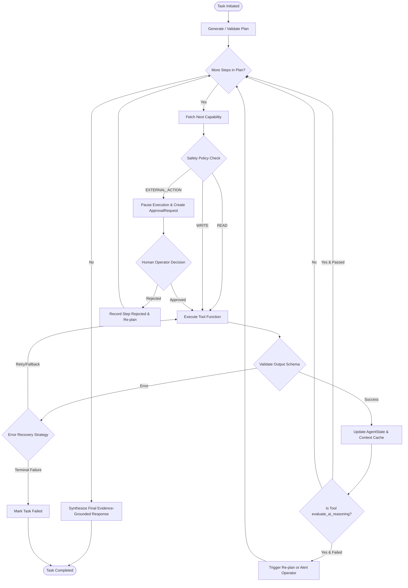

# Phase 3A — Agent Architecture & Application Capability Design

**Date:** 2026-10-08  
**Scope:** Architectural Design of Agent Boundary, Typed Application Capability Tools, Safety Policies, Agent State Machine, Planning, and Controlled Executor  
**Status:** ARCHITECTURAL DESIGN COMPLETE (Implementation Deferred to Phase 3B+)  

---

## 1. Executive Summary

Phase 3A defines the architectural blueprint for introducing an **Autonomous Agent & Application Capability Tool Layer** on top of the frozen Phase 2 AI Foundation.

The primary architectural mandate is **strict separation between high-level reasoning and low-level capability execution**:
```text
User Request / Goal
        ↓
      Agent (Intent comprehension, dynamic planning, evaluation interpretation)
        ↓
Execution Controller (Safety policy interceptor, state machine, human approval gate)
        ↓
Application Capability Tools (Typed Pydantic contracts, idempotent, boundary-enforced)
        ↓
Canonical Domain Modules (Enrichment, Intelligence, Scoring, AI Reasoners, Evaluation)
        ↓
Infrastructure Layer (Playwright, Sockets, PostgreSQL, External LLM APIs)
```

The Agent **never** directly accesses database connections, raw HTTP sockets, Playwright browser instances, scraping internals, or deterministic scoring math. All capabilities are exposed through typed, policy-governed tools.

---

## 2. Agent Responsibility Boundaries

To prevent the common architectural failure mode where an agent becomes an unmaintainable "God Object", we establish strict responsibility boundaries:

### What the Agent IS Responsible For:
1. **User Intent Comprehension**: Parsing human instructions (e.g., *"Find local dental clinics in Austin with poor reviews and prepare outreach teardowns"* or *"Re-evaluate Acme Plumbing's outreach after their website was restored"*).
2. **Dynamic Capability Planning**: Selecting which capabilities are required, in what sequence, and with what parameters.
3. **Task State & Context Orchestration**: Maintaining task progression, caching intermediate domain models (`ProspectContext`, `OpportunityAnalysis`, `OutreachStrategy`), and logging execution traces.
4. **Evaluation Interpretation**: Analyzing [`EvaluationResult`](file:///Users/ashik/Bens%20Repository/scrapper/evaluation/models.py); if grounding is weak or hallucination flags are raised, deciding whether to refine the reasoning angle, gather more data, or escalate to human review.
5. **Synthesis & Human Communication**: Producing transparent, explainable summaries linking sales strategy directly to verified evidence.

### What the Agent IS NOT Responsible For:
1. **Direct SQL / Database Manipulation**: NO `SELECT`, `INSERT`, `UPDATE`, `psycopg2`, or connection pool interactions. All state reads/writes pass through typed repository tool interfaces.
2. **Scraper / Browser Mechanics**: NO Playwright selectors, DOM manipulation, browser lifecycle management, or HTML parsing.
3. **Raw Network & Sockets**: NO raw HTTP `requests`, socket connections, DNS MX lookups, or SSL cert checks.
4. **Deterministic Heuristic Calculations**: NO custom math for opportunity scores, health indices, or buying intent. The Agent must delegate to canonical domain engines ([`ScoringEngine`](file:///Users/ashik/Bens%20Repository/scrapper/analyzer/scoring_engine.py), [`BusinessHealthScore`](file:///Users/ashik/Bens%20Repository/scrapper/business_intelligence/business_health_score.py), [`IntentEngine`](file:///Users/ashik/Bens%20Repository/scrapper/intent/intent_engine.py)).
5. **Prompt Engineering for Core Domain Reasoning**: The Agent does NOT write zero-shot prompts for business diagnostics. It delegates to the frozen, grounded services: [`OpportunityReasoner`](file:///Users/ashik/Bens%20Repository/scrapper/ai/opportunity_reasoner.py) and [`OutreachReasoner`](file:///Users/ashik/Bens%20Repository/scrapper/ai/outreach_reasoner.py).

---

## 3. Application Capability Tool Catalog

We define a minimal, high-leverage set of typed capability tools that expose platform functionality without leaking implementation details:

| Capability Tool | Purpose | Input Schema | Output Schema | Canonical Delegator | Policy Class | Invocation |
| :--- | :--- | :--- | :--- | :--- | :--- | :--- |
| **`discover_prospects`** | Discover candidate businesses by keyword and location. | `DiscoveryInput` (query, location, limit, source) | `DiscoveryOutput` (businesses: List[Business]) | `GoogleMapsScraper`, `JustDialScraper`, `IndiaMartScraper` | `READ` | Automatic |
| **`audit_website_tech`** | Audit website DOM, mobile friendliness, DNS, SSL, and tech stack. | `WebsiteAuditInput` (website_url, business_name) | `WebsiteAuditOutput` (has_ssl, is_mobile, load_time, tech_stack, cms) | `WebsiteAnalyzer`, `TechSignalAnalyzer`, `TechStackDetector` | `READ` | Automatic |
| **`enrich_leadership_social`** | Identify key decision-makers, validate emails, and score social activity. | `EnrichmentInput` (business_name, website_url) | `EnrichmentOutput` (decision_makers, validated_emails, social_profiles) | `DecisionMakerFinder`, `EmailValidator`, `SocialAnalyzer` | `READ` | Automatic |
| **`mine_business_intelligence`** | Extract customer pain points, review themes, and competitor comparison gap. | `IntelligenceInput` (business_name, category, rating, review_count) | `BusinessIntelligence` | `ReviewMiner`, `CustomerPainExtractor`, `CompetitorAnalyzer` | `READ` | Automatic |
| **`calculate_health_and_scores`** | Calculate normalized polarities and opportunity penalties. | `ScoreInput` (audit_data, intelligence_data, intent_data) | `ScoreCard` | `ScoringEngine`, `BusinessHealthScore`, `IntentEngine` | `READ` | Automatic |
| **`assemble_prospect_context`** | Compile verified findings, scores, and provenance into token-efficient context. | `ContextAssemblyInput` (business, stages_data) | `ProspectContext` | `ProspectContextBuilder` | `READ` | Automatic |
| **`synthesize_opportunity_analysis`** | Formulate executive diagnosis and commercial recommendations via AI. | `OpportunityInput` (context: ProspectContext) | `OpportunityAnalysis` | `OpportunityReasoner` | `READ` | Automatic |
| **`formulate_outreach_strategy`** | Devise consultative pitch angle, objection handling, and personalized copy strategy. | `OutreachStrategyInput` (context, opportunity_analysis) | `OutreachStrategy` | `OutreachReasoner` | `READ` | Automatic |
| **`evaluate_ai_reasoning`** | Deterministically verify grounding, polarity adherence, and heuristic hallucinations. | `EvaluationInput` (context, opportunity_analysis, outreach_strategy) | `EvaluationResult` | `EvaluationRunner` | `READ` | Automatic |
| **`render_outreach_drafts`** | Render and store finalized cold email and WhatsApp messaging drafts. | `RenderDraftInput` (context, outreach_strategy) | `OutreachDraft` | `OutreachGenerator` | `WRITE` | Automatic (Staged) |
| **`dispatch_communication`** *(Future)* | Send cold email or WhatsApp message to external recipient. | `DispatchInput` (recipient, channel, message_body) | `DispatchResult` (status, external_id, timestamp) | External Gateway (SMTP / Twilio) | `EXTERNAL_ACTION` | **Explicit Human Approval Required** |

---

## 4. Capability Safety Policy Matrix

To protect systems and brand reputation, every tool is assigned a safety classification enforced by the Execution Controller:

```text
               ┌────────────────────────────────────────────────────────┐
               │ Tool Safety Enforcement Policy                         │
               ├────────────────────────┬───────────────────────────────┤
               │ READ                   │ Automatic execution allowed   │
               │ WRITE                  │ Staged / Restricted execution │
               │ EXTERNAL_ACTION        │ Explicit Human Approval Gate  │
               └────────────────────────┴───────────────────────────────┘
```

### 1. `READ` (Zero Side-Effects)
- **Policy**: Allowed automatically in agent loops.
- **Scope**: Discovery, scraping, enrichment, business intelligence, scoring, context building, AI reasoning, evaluation.
- **Guarantee**: Does not mutate database records, send messages, or spend financial credits.

### 2. `WRITE` (Local Mutation)
- **Policy**: Restricted execution with schema validation and idempotency keys.
- **Scope**: Persisting outreach drafts to PostgreSQL, updating prospect pipeline stage, recording task run summaries.
- **Guarantee**: Changes are isolated to the platform's internal database; zero external visibility.

### 3. `EXTERNAL_ACTION` (Real-World Impact)
- **Policy**: **Strictly intercepted by the Execution Controller**.
- **Scope**: Sending cold emails, WhatsApp messages, updating third-party CRM records (HubSpot/Salesforce), invoking external webhooks.
- **Guarantee**: The execution engine freezes the task, sets `approval_state = "pending"`, and emits a human review request showing the exact copy, recipient, and evidence grounding score. The action is only dispatched upon authenticated human confirmation.

---

## 5. Typed Agent State Architecture

The Agent State is modeled as a typed Pydantic v2 contract:

```python
from typing import Optional, List, Dict, Any
from pydantic import BaseModel, ConfigDict, Field
from schemas.context import ProspectContext
from schemas.ai import OpportunityAnalysis, OutreachStrategy
from evaluation.models import EvaluationResult

class PlanStep(BaseModel):
    step_id: int
    capability_name: str
    description: str
    arguments: Dict[str, Any]
    status: str = Field(default="pending", pattern="^(pending|in_progress|completed|failed|skipped)$")

class ExecutionRecord(BaseModel):
    step_id: int
    capability_name: str
    duration_ms: float
    success: bool
    output_summary: Optional[str] = None
    error_message: Optional[str] = None

class ApprovalRequest(BaseModel):
    request_id: str
    capability_name: str
    action_type: str = "EXTERNAL_ACTION"
    payload: Dict[str, Any]
    rationale: str
    grounding_score: float
    status: str = Field(default="pending", pattern="^(pending|approved|rejected)$")

class AgentState(BaseModel):
    """
    Typed, explainable task state for agent orchestration.
    Maintains workflow context without dumping raw database models.
    """
    model_config = ConfigDict(from_attributes=True)

    task_id: str
    user_goal: str
    status: str = Field(default="planning", pattern="^(planning|executing|waiting_for_approval|completed|failed)$")
    current_step_index: int = 0
    plan: List[PlanStep] = Field(default_factory=list)
    completed_steps: List[ExecutionRecord] = Field(default_factory=list)
    
    # Typed Intermediate Domain Models
    prospect_context: Optional[ProspectContext] = None
    opportunity_analysis: Optional[OpportunityAnalysis] = None
    outreach_strategy: Optional[OutreachStrategy] = None
    evaluation_result: Optional[EvaluationResult] = None
    
    # Human-in-the-Loop & Error Handling
    approval_request: Optional[ApprovalRequest] = None
    errors: List[str] = Field(default_factory=list)
    final_response: Optional[str] = None
```

---

## 6. Planning Model

The Agent converts high-level user instructions into a structured, dependency-aware execution plan:

```text
User Goal: "Find dental clinics in Austin with poor ratings and prepare consultative outreach."
                                    ↓
                            Agent Planner
                                    ↓
Plan Generated:
1. discover_prospects            [args: query="dentist", location="Austin, TX", limit=5]
2. audit_website_tech            [args: website_url=biz.website, business_name=biz.name]
3. mine_business_intelligence    [args: business_name=biz.name, rating=biz.rating]
4. calculate_health_and_scores   [args: audit_data, intelligence_data]
5. assemble_prospect_context     [args: biz, scores, intelligence]
6. synthesize_opportunity_analysis [args: context]
7. formulate_outreach_strategy   [args: context, opportunity_analysis]
8. evaluate_ai_reasoning         [args: context, opportunity_analysis, outreach_strategy]
9. render_outreach_drafts        [args: context, outreach_strategy]
```

### Dynamic Pruning & Branching Rules:
1. **Missing Website Shortcut**: If `biz.website` is absent, the planner prunes `audit_website_tech` and sets `website_weakness_penalty = 100.0` directly.
2. **Evaluation Quality Gate**: If `evaluate_ai_reasoning` returns `passed == False` or raises severe hallucination flags:
   - *Option A (Self-Correction)*: Agent re-triggers `synthesize_opportunity_analysis` with tighter context constraints.
   - *Option B (Human Escalation)*: Agent pauses and alerts the operator: *"Diagnosis contains ungrounded claims; manual review required."*
3. **Execution Cap**: Maximum step threshold (e.g., 15 steps per task) prevents infinite reasoning loops.

---

## 7. Execution Model (The Controlled Executor)

The Execution Controller is a deterministic state machine managing step-by-step tool dispatch:



### Key Execution Guarantees:
1. **Policy Interception**: The executor checks the tool class *before* invoking any code. An `EXTERNAL_ACTION` cannot be triggered silently by prompt injection or model hallucination.
2. **Schema Sandboxing**: All tool inputs and outputs are validated via Pydantic before entering `AgentState`.
3. **Idempotent Resumption**: Tasks paused for human approval can be serialized to disk/database and resumed cleanly upon user callback without re-running earlier discovery or scraping steps.
4. **Crash-Resistant Degradation**: If an external LLM endpoint fails during reasoning, the executor leverages the underlying reasoner's safe deterministic fallback without crashing the agent pipeline.

---

## 8. Summary of Phase 3 Roadmap

| Milestone | Scope | Deliverables | Status |
| :--- | :--- | :--- | :--- |
| **Phase 3A** | Agent Architecture & Capability Design | [`AI_MEMORY/PHASE_3A_AGENT_ARCHITECTURE.md`](file:///Users/ashik/Bens%20Repository/scrapper/AI_MEMORY/PHASE_3A_AGENT_ARCHITECTURE.md) | **COMPLETE (Design Only)** |
| **Phase 3B** | Application Capability Tool Contracts | Implementation of `agent/tools/` with typed Pydantic contracts | PENDING |
| **Phase 3C** | Agent State & Policy Controller | Implementation of `AgentState`, policy engine, and executor | PENDING |
| **Phase 3D** | Agent Orchestration & Testing | End-to-end integration with mock and real execution runs | PENDING |
