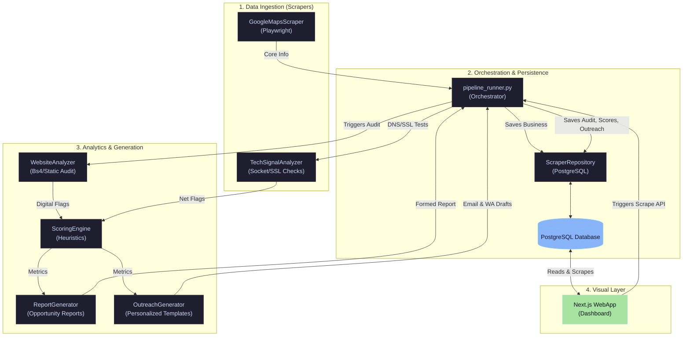

# Business Opportunity Intelligence Platform — Project Architecture

This document provides a comprehensive, high-resolution map of the entire platform's architecture, file structure, data flow, and database models to guide the implementation of the next layers.

---

## 1. System Architecture Overview

The system is a modular, end-to-end business intelligence pipeline designed to find local business leads, analyze their online presence, score their potential as clients, and auto-generate custom sales outreach.



---

## 2. Directory Structure & Key Files

Here is the exact physical layout of the repository with clickable paths to each file:

### 📂 Root Directory
*   [`pipeline_runner.py`](file:///home/bensbasil/ai-projects/scraper-project/pipeline_runner.py): The main orchestrator CLI class [`MVPPipeline`](file:///home/bensbasil/ai-projects/scraper-project/pipeline_runner.py#L48) that imports all modules, sequences the workflow, manages exceptions, and saves processed leads to the database.
*   [`DATA_DICTIONARY.md`](file:///home/bensbasil/ai-projects/scraper-project/DATA_DICTIONARY.md): The semantic field-level documentation of all metrics.
*   [`PROJECT_CONTEXT.md`](file:///home/bensbasil/ai-projects/scraper-project/PROJECT_CONTEXT.md): Project overview, focus, stack, and development philosophy.

### 📂 Scraper Engine ([`scraper/`](file:///home/bensbasil/ai-projects/scraper-project/scraper))
*   [`base_scraper.py`](file:///home/bensbasil/ai-projects/scraper-project/scraper/base_scraper.py): Abstract base class [`BaseScraper`](file:///home/bensbasil/ai-projects/scraper-project/scraper/base_scraper.py#L4) enforcing `fetch_raw`, `parse_data`, and `normalize` methods.
*   [`pipeline.py`](file:///home/bensbasil/ai-projects/scraper-project/scraper/pipeline.py): Aggregator for orchestrating sequential runs of multiple base scrapers.
*   [`google_maps.py`](file:///home/bensbasil/ai-projects/scraper-project/scraper/connectors/public_web/google_maps.py): Real browser Playwright automation that clicks through business profiles on Google Maps and scrapes address, ratings, reviews, phone, and website.
*   [`company_website.py`](file:///home/bensbasil/ai-projects/scraper-project/scraper/connectors/public_web/company_website.py): Fast static scraper built with BeautifulSoup to inspect websites for technical capabilities (meta titles, responsiveness, forms, H1, WhatsApp links, and socials).
*   [`tech_signals.py`](file:///home/bensbasil/ai-projects/scraper-project/scraper/connectors/technical/tech_signals.py): Low-overhead network analyzer checking socket connection, SSL certificate validity, and DNS resolution.
*   [`social_scraper.py`](file:///home/bensbasil/ai-projects/scraper-project/scraper/connectors/social/social_scraper.py): *[Placeholder]* Planned for future deep social network audits.

### 📂 Scoring & Outreach Generation ([`analyzer/`](file:///home/bensbasil/ai-projects/scraper-project/analyzer))
*   [`scoring_engine.py`](file:///home/bensbasil/ai-projects/scraper-project/analyzer/scoring_engine.py): Heuristics algorithm calculating:
    *   **Website Quality Score** (penalizes lack of forms, WhatsApp, mobile responsiveness)
    *   **SEO Score** (penalizes missing H1, meta titles, descriptions)
    *   **Automation Need Score** (evaluates lack of modern widgets, contact routes)
    *   **Opportunity Score** (weighted combination of the above, flagging prime sales targets)
*   [`business_report_generator.py`](file:///home/bensbasil/ai-projects/scraper-project/analyzer/business_report_generator.py): Translates scores into human-readable opportunity audits.
*   [`outreach_generator.py`](file:///home/bensbasil/ai-projects/scraper-project/analyzer/outreach_generator.py): Templates precise sales copy (Cold Email and WhatsApp messages) dynamically injected with the client's actual technical mistakes.
*   [`seo_checker.py`](file:///home/bensbasil/ai-projects/scraper-project/analyzer/seo_checker.py) / [`social_analyzer.py`](file:///home/bensbasil/ai-projects/scraper-project/analyzer/social_analyzer.py): *[Placeholders]* For advanced analytical capabilities.

### 📂 Database Persistence ([`database/`](file:///home/bensbasil/ai-projects/scraper-project/database))
*   [`schema.sql`](file:///home/bensbasil/ai-projects/scraper-project/database/schema.sql): PostgreSQL tables (`businesses`, `website_analyses`, `scoring_results`, `business_reports`, `outreach_drafts`) designed with cascading foreign keys and performance indexes.
*   [`db.py`](file:///home/bensbasil/ai-projects/scraper-project/database/db.py): High-performance database wrapper including a thread-safe connection pool [`DatabaseManager`](file:///home/bensbasil/ai-projects/scraper-project/database/db.py#L11) and a clean data access layer [`ScraperRepository`](file:///home/bensbasil/ai-projects/scraper-project/database/db.py#L42).

### 📂 Dashboard WebApp ([`dashboard/`](file:///home/bensbasil/ai-projects/scraper-project/dashboard))
*   A fully developed **Next.js** dashboard featuring:
    *   **List & Grid views** of discovered opportunities.
    *   **Detailed side-drawers** showcasing technical digital audits, scores, and auto-generated outreach drafts.
    *   **Filter capabilities** to isolate high-priority targets.
    *   **An interactive control panel** calling the scraper API to run Playwright in the background.

---

## 3. Core Data Flow & Lifecycle of a Lead

Every single local business lead goes through the following states in our pipeline:

```
[Google Maps Search] 
        │
        ▼
 (Ingestion)      Scrapes name, address, website URL, ratings, reviews, and phone numbers.
        │
        ▼
 (Persistence)    Upserted into 'businesses' table (deduplicated by name + address combination).
        │
        ▼
 (Technical Audit) Website Analyzer performs lightweight HTML parsing. DNS/SSL checks run.
        │
        ▼
 (Rule Evaluation) Scoring Engine consumes digital audit flags, generating mathematical 0-100 scores.
        │
        ▼
 (Copy Generation) Report Generator & Outreach Generator template structured pitches & emails.
        │
        ▼
 (Enrichment Store) All audit flags, opportunity scores, and custom emails are saved to DB.
        │
        ▼
 (Visualization)  Dashboard queries PostgreSQL to display leads, scores, and pitches in real time.
```

---

## 4. Next Layers & Development Roadmap

Now that the core architecture is established with over 500+ processed database entries, here are the potential next layers that can be developed:

### 🚀 Layer A: Active LLM Outreach Integration
Currently, outreach templates are rule-based string replacements.
*   **The Next Step:** Integrate the Gemini or OpenAI API to read the technical audit results, the business category, and Google ratings to write an extremely natural, bespoke, AI-written outreach email tailored for that exact business.

### 🚀 Layer B: Implementing Placeholder Scrapers
We have three empty placeholders: [`social_scraper.py`](file:///home/bensbasil/ai-projects/scraper-project/scraper/connectors/social/social_scraper.py), [`seo_checker.py`](file:///home/bensbasil/ai-projects/scraper-project/analyzer/seo_checker.py), and [`social_analyzer.py`](file:///home/bensbasil/ai-projects/scraper-project/analyzer/social_analyzer.py).
*   **The Next Step:** Add actual social presence scraping (e.g. validating if Facebook/Instagram links are broken, detecting the last post date to determine active marketing, checking if pixel trackers are missing).

### 🚀 Layer C: Advanced Dashboard Features
Our Next.js dashboard visualizes Postgres data but can be enhanced.
*   **The Next Step:** Add "Outreach Status Tracking" (Mark leads as *New*, *Contacted*, *Followed-up*, *Closed*), integrate direct email sending through Resend/SendGrid, or support bulk CSV exporting of customized pitches.

---

> [!NOTE]
> All core infrastructure is modular. You can safely build on top of any layer without breaking adjacent components.
