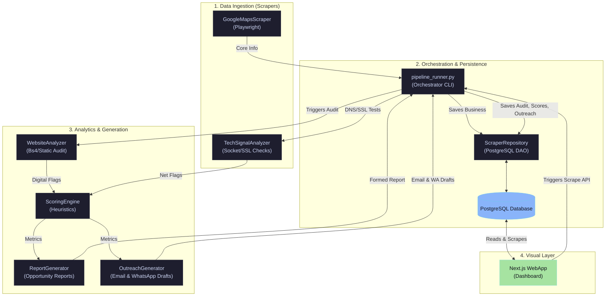

# Business Opportunity Intelligence Platform

An end-to-end local business discovery, enrichment, digital presence analysis, scoring, and automated outreach platform. It is designed to find local service opportunities (such as web development, SEO, custom automation, or AI integrations) by identifying businesses with outdated or missing digital infrastructure and generating tailored pitches to contact them.

---

## 🏗️ Architecture Overview

The system is structured as a modular, feed-forward intelligence pipeline:



For a detailed view of the code layout, see [PROJECT_ARCHITECTURE.md](PROJECT_ARCHITECTURE.md) and [DATA_DICTIONARY.md](DATA_DICTIONARY.md).

---

## 📁 Repository Structure

```
├── pipeline_runner.py         # Primary pipeline orchestration CLI
├── scraper/                   # Ingestion modules & site checkers
│   ├── base_scraper.py        # Abstract BaseScraper interface
│   ├── pipeline.py            # Connector pipeline aggregator
│   └── connectors/            # Data fetchers (Google Maps, Website Analyzer, DNS/SSL)
├── analyzer/                  # Logic for scoring, reporting, and outreach copy
│   ├── scoring_engine.py      # Rule-based opportunity scorer
│   ├── business_report_generator.py # Formats plain-text opportunities
│   ├── outreach_generator.py  # Generates custom email/WhatsApp templates
│   └── *                      # Experimental conversion & business health scorers
├── enrichment/                # Post-scrape enrichment tools
│   ├── tech_stack_detector.py # CMS & JavaScript tag signatures scan
│   ├── email_extractor.py     # HTML regex email & mailto link crawler
│   └── social_analyzer.py     # Social media URL checker
├── intent/                    # Urgency signal monitors
│   ├── freshness_monitor.py   # Copyright footer & SSL expiry checks
│   ├── hiring_signal_detector.py # Job listings /careers parser
│   └── intent_engine.py       # Synthesis engine for composite intent score
├── database/                  # Storage layers
│   ├── schema.sql             # DB Schema defining tables & indexes
│   └── db.py                  # Thread-safe Connection Pool & DAO Repository
└── dashboard/                 # Next.js web application visualizer
```

---

## 🛠️ Technical Stack

*   **Backend & CLI:** Python 3.12+
*   **Web Scraping & DOM Automation:** Playwright, BeautifulSoup4
*   **Database:** PostgreSQL 15+ (using `psycopg2`)
*   **Frontend Dashboard:** Next.js (React), Vanilla CSS (premium UI dashboard)
*   **Environment & Configuration:** Python-dotenv

---

## 🚀 Setup and Installation

### 1. Prerequisites
Ensure you have the following installed:
*   Python 3.12+
*   PostgreSQL
*   Node.js (for Dashboard)

### 2. Environment Configuration
Create a `.env` file in the root directory:
```bash
DATABASE_URL=postgresql://<username>:<password>@localhost:5432/scraper_db
# Optional: OpenAI or Gemini keys for future generative copy integrations
```

### 3. Python Backend Setup
Initialize the virtual environment and install packages:
```bash
# Set up virtual environment
python3 -m venv .venv
source .venv/bin/activate

# Install dependencies
pip install -r requirements.txt

# Install Playwright browser engines
playwright install chromium
```

### 4. Running the Scraping Pipeline
Use `pipeline_runner.py` to trigger scraping, analysis, scoring, and storage.

```bash
# Run with a raw search query
python pipeline_runner.py "Gyms in Trivandrum, Kerala" --limit 5

# Run using structural parameters (Category + Location)
python pipeline_runner.py --category "Hospitals" --city "Kochi" --limit 3
```

### 5. Running the Frontend Dashboard
Navigate to the `dashboard` directory and spin up the development server:
```bash
cd dashboard
npm install
npm run dev
```
Open `http://localhost:3000` in your browser.

---

## 📊 Core Data Schema

The PostgreSQL database manages the following entities:
*   `businesses`: Core business data (name, address, phone, website, maps rating, reviews count).
*   `website_analyses`: Parsed DOM signals (mobile responsiveness, forms found, social links).
*   `scoring_results`: Out-of-100 opportunity, SEO, and automation necessity scores.
*   `business_reports`: Plain-text generated opportunities and weaknesses.
*   `outreach_drafts`: Templated cold outreach pitch copies.
*   `tech_stacks`: Detected libraries, tracking scripts, and frameworks.
*   `email_intelligence`: Extracted emails and mailto links.

---

## 🛣️ Development Status

*   **Completed:** Core pipeline scraping, HTML DOM static audits, DNS/SSL signal tracking, base heuristic opportunity engine, database repository persistence, and Next.js visual interface.
*   **In Progress:** Phase 2 Intent features (SSL expiry monitors, careers hiring signal crawlers, social link validator audits).
*   **Upcoming (Phase 3 & 4):** Email validation, Decision-maker identification from website Team pages, Entity deduplication, and India-specific directory connectors (JustDial/IndiaMart).
